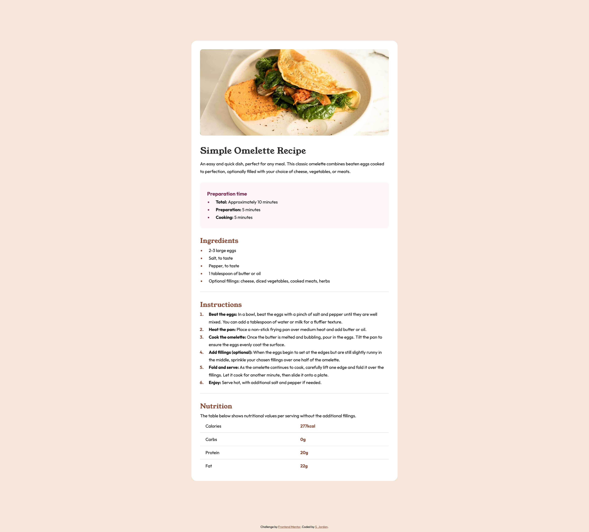

# Frontend Mentor - Recipe page solution

This is a solution to the [Recipe page challenge on Frontend Mentor](https://www.frontendmentor.io/challenges/recipe-page-KiTsR8QQKm). Frontend Mentor challenges help you improve your coding skills by building realistic projects. 

## Table of contents

- [Overview](#overview)
  - [The challenge](#the-challenge)
  - [Screenshot](#screenshot)
  - [Links](#links)
- [My process](#my-process)
  - [Built with](#built-with)
  - [What I learned](#what-i-learned)
  - [Useful resources](#useful-resources)
- [Author](#author)

## Overview

### Screenshot

### Links

- Solution URL: [Solution on Frontend Mentor](https://www.frontendmentor.io/solutions/recipe-page-with-flexbox-and-css-grid-AaAr0HZzSv)
- Live Site URL: [GitHub Pages](https://curricle.github.io/Recipe-Page/)

## My process

### Built with

- Semantic HTML5 markup
- CSS custom properties
- Flexbox
- CSS Grid

### What I learned

I learned that you can customize list markers, which is not something I knew how to do prior to this project.

### Useful resources

- [CSS Grid Guide by CSS Tricks](https://css-tricks.com/snippets/css/complete-guide-grid/) - Useful resource for brushing up on the basics of CSS grid layouts.
- [::marker Pseudoelement Documentation by Mozilla](https://developer.mozilla.org/en-US/docs/Web/CSS/::marker) - This helped me style the the list markers.

## Author

- Website - [Steph Jordan](https://jordanmakes.com)
- Frontend Mentor - [@curricle](https://www.frontendmentor.io/profile/curricle)
